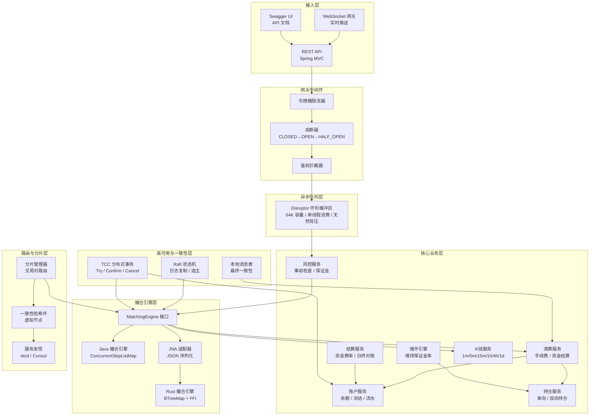
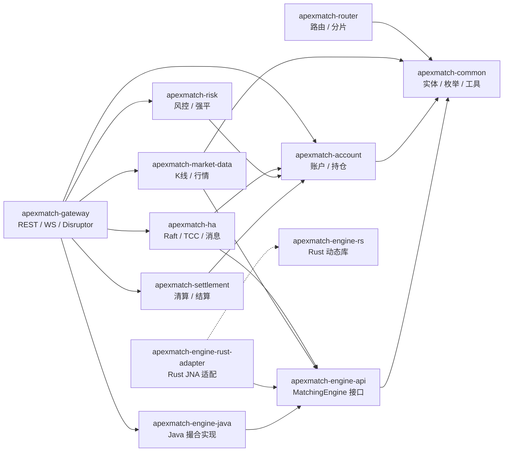
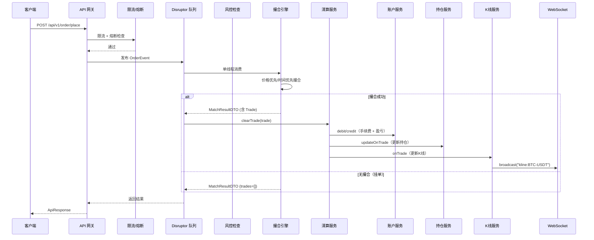
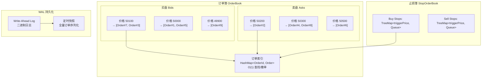
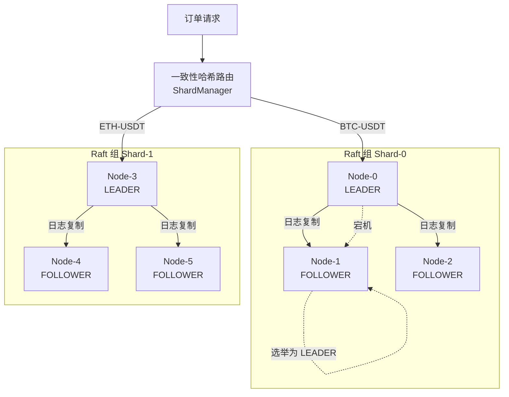
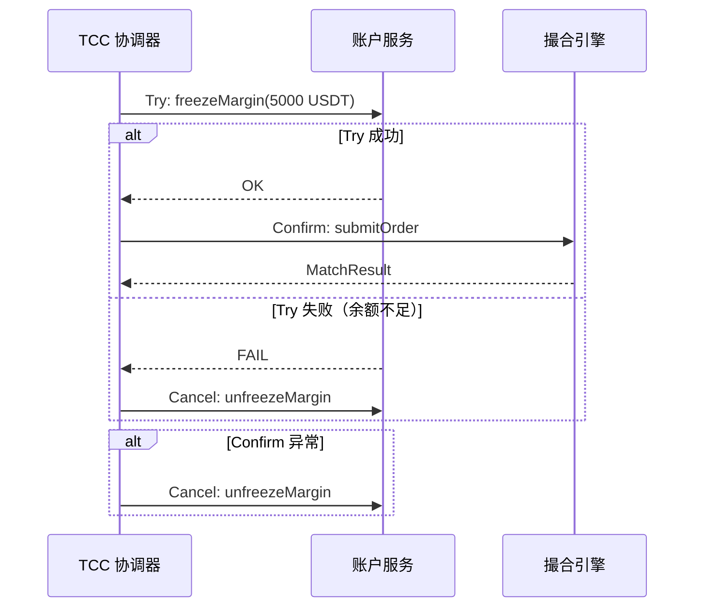

# ApexMatch 系统架构文档

## 一、系统总体架构

```mermaid
graph TB
    subgraph 接入层
        REST["REST API<br/>Spring MVC"]
        WS["WebSocket 网关<br/>实时推送"]
        SWAGGER["Swagger UI<br/>API 文档"]
    end

    subgraph 网关中间件
        RL["令牌桶限流器"]
        CB["熔断器<br/>CLOSED→OPEN→HALF_OPEN"]
        AUTH["鉴权拦截器"]
    end

    subgraph 异步队列层
        DISRUPTOR["Disruptor 环形缓冲区<br/>64K 容量 / 单线程消费 / 天然背压"]
    end

    subgraph 核心业务层
        ACCOUNT["账户服务<br/>余额 / 冻结 / 流水"]
        POSITION["持仓服务<br/>单向 / 双向持仓"]
        RISK["风控服务<br/>事前检查 / 保证金"]
        CLEARING["清算服务<br/>手续费 / 资金结算"]
        SETTLEMENT["结算服务<br/>资金费率 / 日终对账"]
        LIQUIDATION["强平引擎<br/>维持保证金率"]
        KLINE["K线服务<br/>1m/5m/15m/1h/4h/1d"]
    end

    subgraph 撮合引擎层
        ENGINE_API["MatchingEngine 接口"]
        JAVA_ENGINE["Java 撮合引擎<br/>ConcurrentSkipListMap"]
        RUST_ENGINE["Rust 撮合引擎<br/>BTreeMap + FFI"]
        ADAPTER["JNA 适配器<br/>JSON 序列化"]
    end

    subgraph 高可用与一致性层
        RAFT["Raft 状态机<br/>日志复制 / 选主"]
        TCC["TCC 分布式事务<br/>Try / Confirm / Cancel"]
        MSG["本地消息表<br/>最终一致性"]
    end

    subgraph 路由与分片层
        HASH["一致性哈希环<br/>虚拟节点"]
        SHARD["分片管理器<br/>交易对路由"]
        REGISTRY["服务发现<br/>etcd / Consul"]
    end

    REST --> RL --> CB --> AUTH --> DISRUPTOR
    WS --> REST
    SWAGGER --> REST

    DISRUPTOR --> RISK
    RISK --> ENGINE_API
    ENGINE_API --> JAVA_ENGINE
    ENGINE_API --> ADAPTER --> RUST_ENGINE
    ENGINE_API --> CLEARING
    CLEARING --> ACCOUNT
    CLEARING --> POSITION
    ENGINE_API --> KLINE
    SETTLEMENT --> ACCOUNT
    LIQUIDATION --> POSITION

    RAFT --> ENGINE_API
    TCC --> ACCOUNT
    TCC --> ENGINE_API
    MSG --> CLEARING

    SHARD --> HASH
    HASH --> REGISTRY
    SHARD --> ENGINE_API
```

---

## 二、模块依赖关系

```mermaid
graph LR
    COMMON["apexmatch-common<br/>实体 / 枚举 / 工具"]
    API["apexmatch-engine-api<br/>MatchingEngine 接口"]
    JAVA_ENG["apexmatch-engine-java<br/>Java 撮合实现"]
    RUST_ADAPTER["apexmatch-engine-rust-adapter<br/>Rust JNA 适配"]
    ACCOUNT["apexmatch-account<br/>账户 / 持仓"]
    SETTLEMENT["apexmatch-settlement<br/>清算 / 结算"]
    RISK["apexmatch-risk<br/>风控 / 强平"]
    MARKET["apexmatch-market-data<br/>K线 / 行情"]
    HA["apexmatch-ha<br/>Raft / TCC / 消息"]
    ROUTER["apexmatch-router<br/>路由 / 分片"]
    GATEWAY["apexmatch-gateway<br/>REST / WS / Disruptor"]
    RUST["apexmatch-engine-rs<br/>Rust 动态库"]

    API --> COMMON
    JAVA_ENG --> API
    RUST_ADAPTER --> API
    RUST_ADAPTER -.-> RUST
    ACCOUNT --> COMMON
    SETTLEMENT --> ACCOUNT
    RISK --> ACCOUNT
    MARKET --> COMMON
    MARKET --> API
    HA --> API
    HA --> ACCOUNT
    ROUTER --> COMMON
    GATEWAY --> JAVA_ENG
    GATEWAY --> ACCOUNT
    GATEWAY --> SETTLEMENT
    GATEWAY --> RISK
    GATEWAY --> MARKET
    GATEWAY --> HA
```

---

## 三、订单处理数据流

```mermaid
sequenceDiagram
    participant C as 客户端
    participant GW as API 网关
    participant RL as 限流/熔断
    participant DQ as Disruptor 队列
    participant RC as 风控检查
    participant ME as 撮合引擎
    participant CL as 清算服务
    participant AC as 账户服务
    participant PS as 持仓服务
    participant KL as K线服务
    participant WS as WebSocket

    C->>GW: POST /api/v1/order/place
    GW->>RL: 限流 + 熔断检查
    RL-->>GW: 通过
    GW->>DQ: 发布 OrderEvent
    DQ->>ME: 单线程消费
    ME->>ME: 价格优先/时间优先撮合
    
    alt 撮合成功
        ME-->>DQ: MatchResultDTO (含 Trade)
        DQ->>CL: clearTrade(trade)
        CL->>AC: debit/credit（手续费 + 盈亏）
        CL->>PS: updateOnTrade（更新持仓）
        CL->>KL: onTrade（更新K线）
        KL->>WS: broadcast("kline:BTC-USDT")
    else 无撮合（挂单）
        ME-->>DQ: MatchResultDTO (trades=[])
    end
    
    DQ-->>GW: 返回结果
    GW-->>C: ApiResponse
```

---

## 四、撮合引擎内部结构

```mermaid
graph TB
    subgraph 订单簿 OrderBook
        subgraph 买盘 Bids
            B1["价格 50100<br/>→ [Order#7, Order#3]"]
            B2["价格 50000<br/>→ [Order#1, Order#5]"]
            B3["价格 49900<br/>→ [Order#9]"]
        end
        subgraph 卖盘 Asks
            A1["价格 50200<br/>→ [Order#2]"]
            A2["价格 50300<br/>→ [Order#4, Order#8]"]
            A3["价格 50500<br/>→ [Order#6]"]
        end
        IDX["订单索引<br/>HashMap&lt;OrderId, Order&gt;<br/>O(1) 查找/撤单"]
    end

    subgraph 止损簿 StopOrderBook
        SB["Buy Stops: TreeMap&lt;triggerPrice, Queue&gt;"]
        SS["Sell Stops: TreeMap&lt;triggerPrice, Queue&gt;"]
    end

    subgraph WAL 持久化
        WAL["Write-Ahead Log<br/>二进制日志"]
        SNAP["定时快照<br/>全量订单序列化"]
    end

    B1 --> IDX
    A1 --> IDX
    SB --> IDX
    WAL --> SNAP
```

---

## 五、高可用架构

```mermaid
graph TB
    subgraph Raft 组 Shard-0
        L["Node-0<br/>LEADER"]
        F1["Node-1<br/>FOLLOWER"]
        F2["Node-2<br/>FOLLOWER"]
    end

    subgraph Raft 组 Shard-1
        L2["Node-3<br/>LEADER"]
        F3["Node-4<br/>FOLLOWER"]
        F4["Node-5<br/>FOLLOWER"]
    end

    CLIENT["订单请求"]
    ROUTER["一致性哈希路由<br/>ShardManager"]

    CLIENT --> ROUTER
    ROUTER -->|BTC-USDT| L
    ROUTER -->|ETH-USDT| L2
    
    L -->|日志复制| F1
    L -->|日志复制| F2
    L2 -->|日志复制| F3
    L2 -->|日志复制| F4

    L -.->|宕机| F1
    F1 -.->|选举为 LEADER| F1
```

---

## 六、TCC 分布式事务流程

```mermaid
sequenceDiagram
    participant CO as TCC 协调器
    participant AS as 账户服务
    participant ME as 撮合引擎

    CO->>AS: Try: freezeMargin(5000 USDT)
    
    alt Try 成功
        AS-->>CO: OK
        CO->>ME: Confirm: submitOrder
        ME-->>CO: MatchResult
    else Try 失败（余额不足）
        AS-->>CO: FAIL
        CO->>AS: Cancel: unfreezeMargin
    end
    
    alt Confirm 异常
        CO->>AS: Cancel: unfreezeMargin
    end
```
